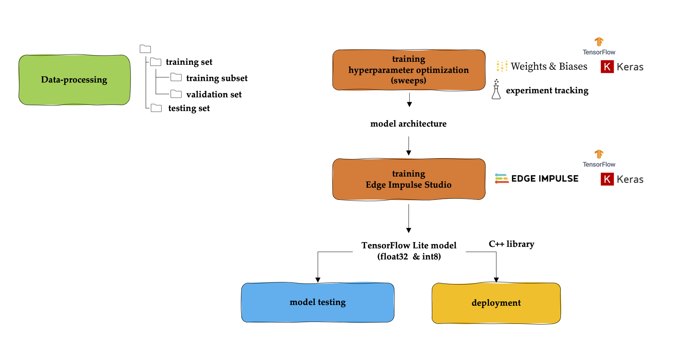

# Machine Learning at the Extreme Edge

Today's challenge is real-time and energy-efficient information extraction and processing at the edge using Artificial Intelligence. However, a recent trend exists to implement machine learning on devices located on the extreme edge, i.e. the border between the analog (physical) and digital world. These devices consist of one or more sensors and a resource-constrained embedded device, i.e. a device with limited memory, computing power, and power consumption. Today's challenge is the development of accurate, energy-efficient machine learning models for deployment on these resource-constrained devices. The project [Machine Learning @ the Extreme Edge](https://mlate2dge.github.io/) examines how to apply embedded machine learning to develop accurate, energy-efficient models for intelligent devices.

Project website: [Machine Learning @ the Extreme Edge](https://mlate2dge.github.io/)<br>
The code: [ML@E2dge](https://github.com/MLatE2dge/mlate2dge)<br>

**Prerequisite:** 
- [Edge Impulse Studio](https://edgeimpulse.com/)
- [Weights & Biases platform](https://wandb.ai/)
- Ubuntu 20.04.5 LTS OS


# Embedded Machine Learning Pipeline

The Embedded Machine Learning Pipeline is shown below. During the project's timeframe, retraining was performed using Edge Impulse Studio. It is recommended for future implementations to use the [Edge Impulse Python SDK](https://docs.edgeimpulse.com/docs/tools/overview) combined with [Weights & Biases](https://docs.edgeimpulse.com/docs/integrations/weights-and-biases).




# Environment Setup

- Create environment - install the dependencies: 

```
$ conda env create -f conda.yaml
```

<br>

```
THE SOFTWARE IS PROVIDED "AS IS", WITHOUT WARRANTY OF ANY KIND, EXPRESS OR
IMPLIED, INCLUDING BUT NOT LIMITED TO THE WARRANTIES OF MERCHANTABILITY,
FITNESS FOR A PARTICULAR PURPOSE AND NONINFRINGEMENT. IN NO EVENT SHALL THE
AUTHORS OR COPYRIGHT HOLDERS BE LIABLE FOR ANY CLAIM, DAMAGES OR OTHER
LIABILITY, WHETHER IN AN ACTION OF CONTRACT, TORT OR OTHERWISE, ARISING FROM,
OUT OF OR IN CONNECTION WITH THE SOFTWARE OR THE USE OR OTHER DEALINGS IN THE
SOFTWARE.
```

---
[Machine Learning @ the Extreme Edge](https://mlate2dge.github.io/) (ML@E2dge) is a project supported by the Karel de Grote University of Applied Sciences and Arts through funding by the Flemish government specifically allocated to practice-based research at universities of applied sciences. Project duration: 1 December 2021 - 31 August 2023 (14 person-month).